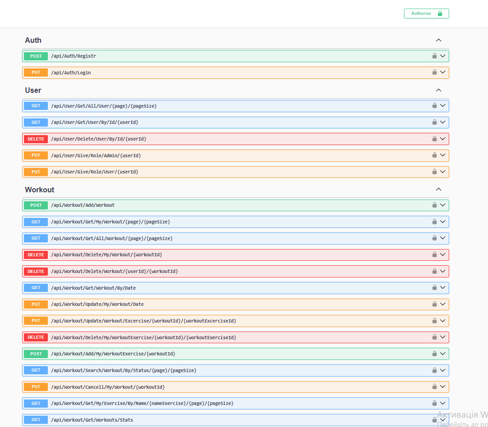
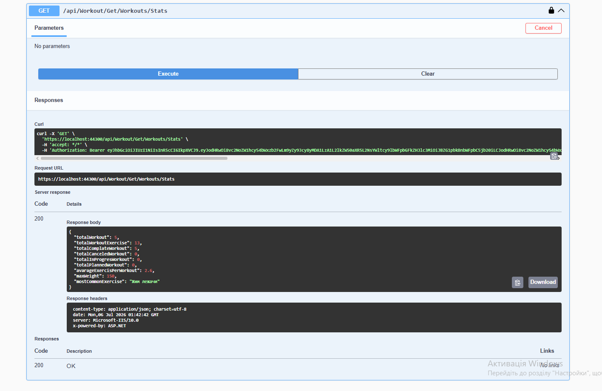

# Training Api

REST API for workout planning, exercise management, and user authentication built with ASP.NET Core Web API.

## Preview

### Swagger API

### Workout Statistics

## Features

- JWT Authentication

- User Management

- Workout Management

- Exercise Management

- Workout Statistics

- Pagination

- Search by Date

- Search by Status

- Cascade Delete

## Technologies

- ASP.NET Core Web API

- Entity Framework Core

- PostgreSQL

- JWT Authentication

- Swagger / OpenAPI

## Getting Started

### Requirements

- .NET 8 SDK
- PostgreSQL

### Installation

- Clone the repository

- Configure the database connection in appsettings.json

- Apply migrations

- Run the project

- Open Swagger

## Future Improvements

- FluentValidation

- Unit Tests

- Docker

- Redis

- Background Service

- Telegram Bot

- Serilog

- Postman Collection
